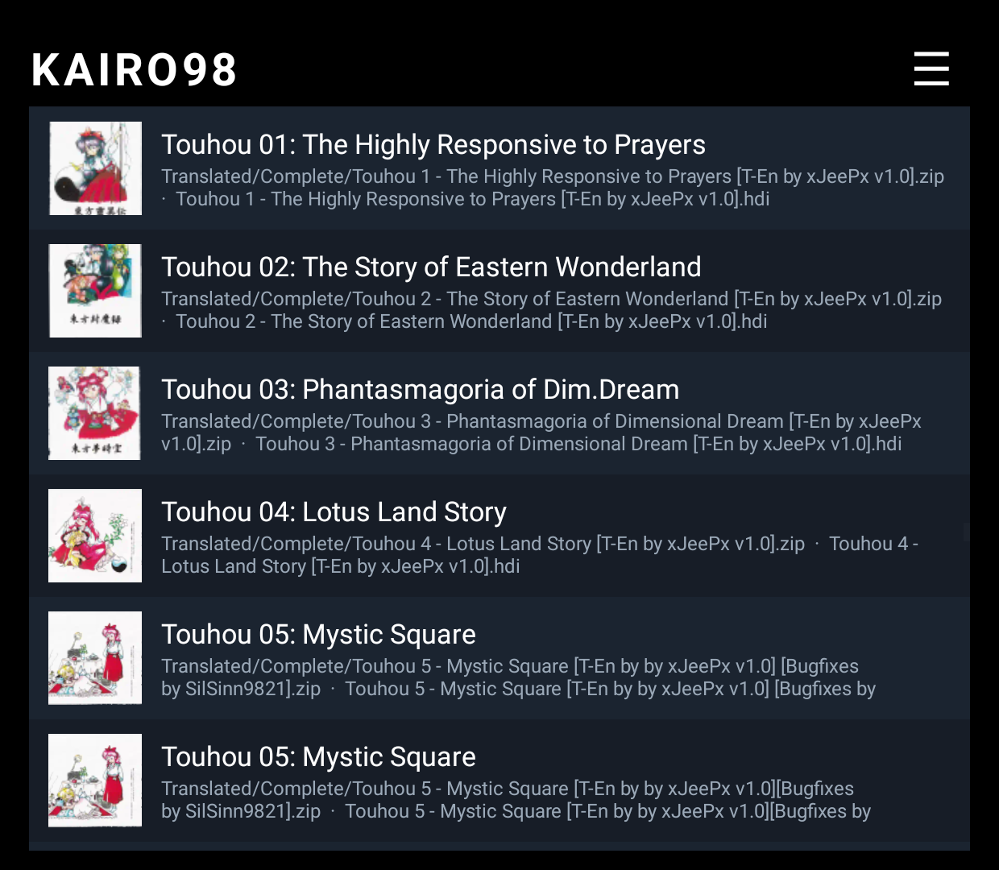
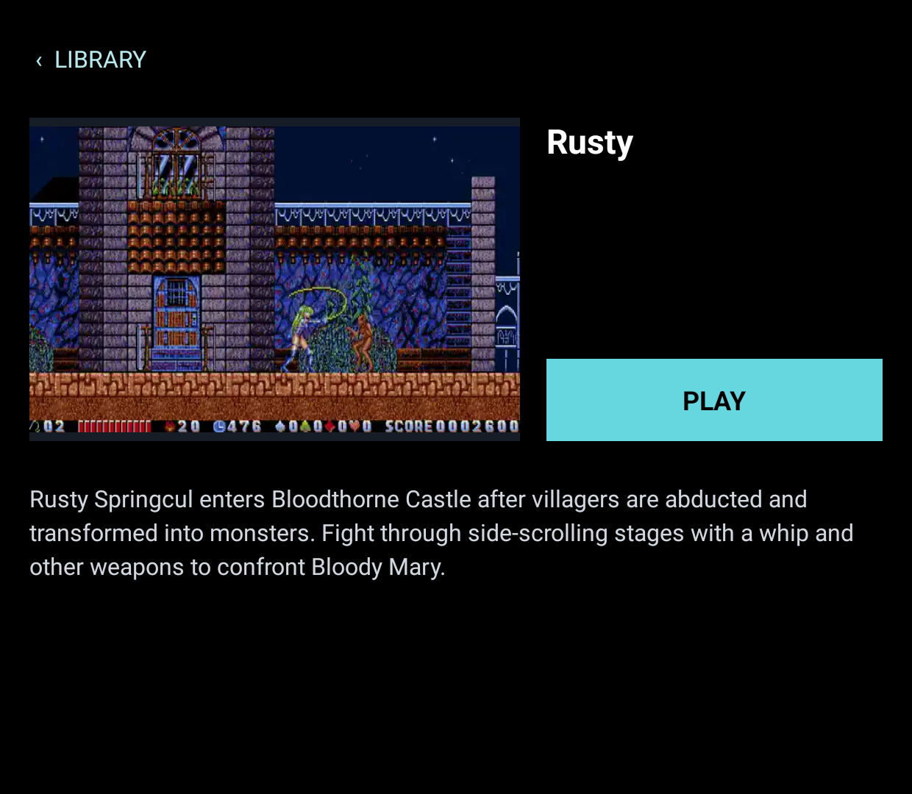
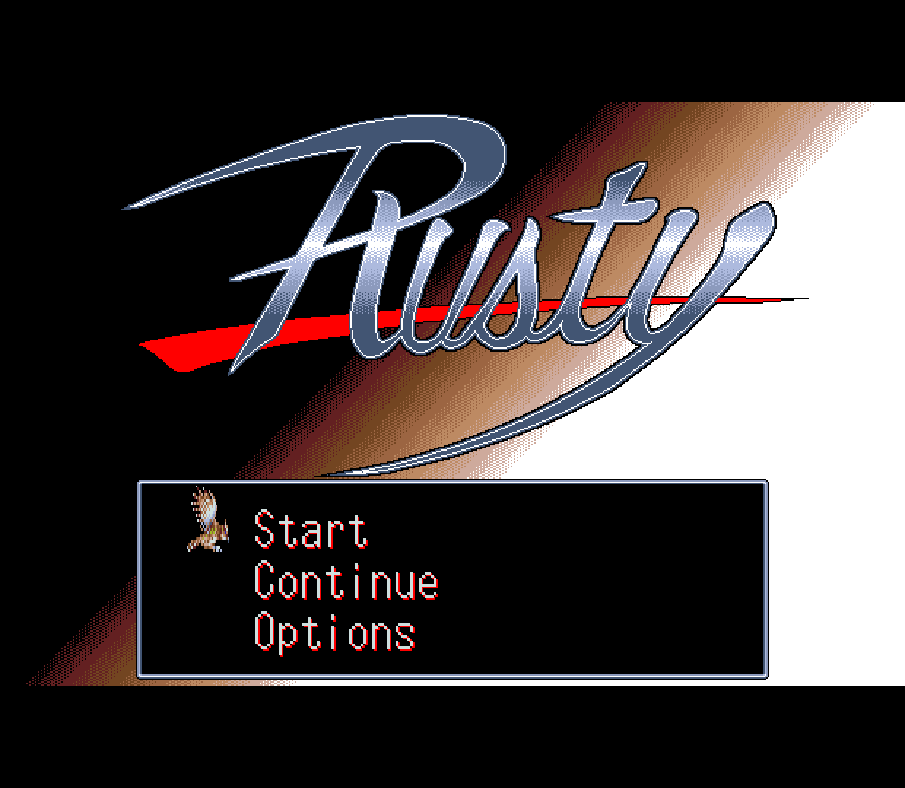
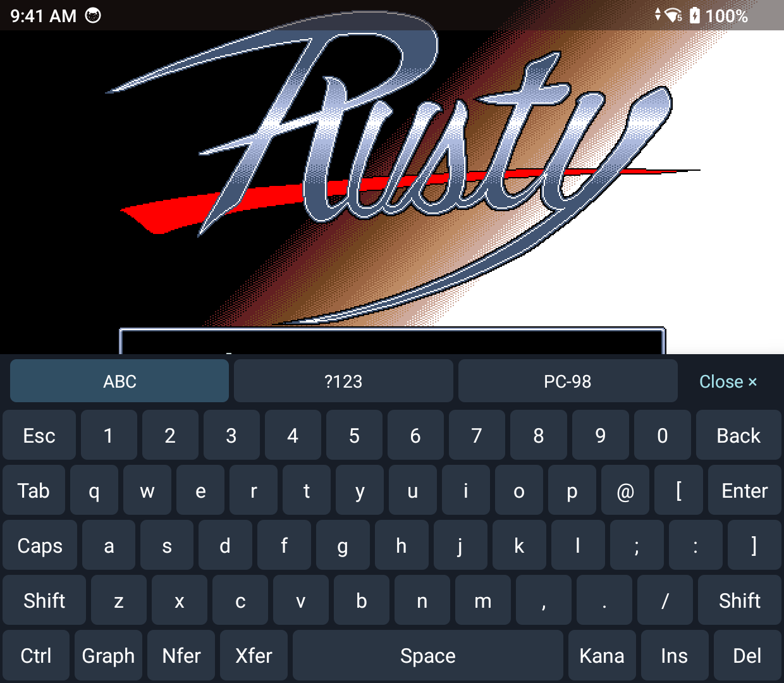

# Kairo98

Kairo98 is a PC-98 emulator for Android, built for phones and handhelds. Browse your games, open one to see its details, and play with a controller or touch controls.

Kairo98 is in active development, and game compatibility varies.

## Screenshots

| Game library | Game details |
| --- | --- |
|  |  |
| Playing a game | On-screen keyboard |
|  |  |

These screenshots show a development build on a Retroid Pocket Classic. The published `v0.2.0` APKs predate some changes shown here.

## Get started

1. Download an APK from [GitHub Releases](https://github.com/MrJackSpade/Kairo98/releases) and install it on an **ARM64 device running Android 8.0 or newer**.
2. On first launch, choose the folder containing your PC-98 disk images. You can skip this and choose a folder later from the library menu.
3. Tap a game to open its details, then tap **Play**. A controller can navigate the library too.

The library reads HDI hard disks and supported floppy formats, including FDI, D88, NFD, HDM, and XDF. Images can be loose files or inside ZIP archives. Kairo98 matches known games by the disk image's contents, so recompressing a ZIP does not change its catalog match. Some games need a separate boot floppy or a specific setup; support for those is still being expanded.

The Releases page offers two APKs. **With images** includes the offline catalog artwork; **without images** is a smaller download. In the no-images build, use **Library menu → Download missing images** to fetch artwork for games in your library. Downloads are saved in the app and can be retried. Both APKs have the same emulator, game information, settings, and controls. A paid Google Play edition is planned with the same features as the free GitHub edition.

Games and firmware are not included with Kairo98.

## Playing and controls

- Map controller buttons to PC-98 keys, joystick buttons, mouse actions, or app controls. Keep a global layout or customize one game.
- Turn on on-screen controls for phones and position them separately in portrait and landscape.
- Swipe in from the **right edge** for the PC-98 keyboard. Tapping the game screen opens the keyboard or acts as a mouse touchpad, depending on the input mode. You can change that mode for each game if Auto chooses poorly.
- On a dual-screen Android handheld, Kairo98 covers the second screen and shows the PC-98 keyboard there during play while the game fills the main screen. If the second screen disconnects, the right-edge keyboard remains available.
- Open the in-game menu with **Android Back**, a swipe from the **left edge**, or a controller Menu/Mode button when the device sends it to the app. From there you can pause, restart, change disks, open settings, or return to the library.
- The default display mode keeps the entire picture visible with integer scaling. Cropped integer scaling and fit-to-screen scaling are optional.

You can import your own BIOS ROM, font bitmap, and YM2608 rhythm ROM from **Machine** settings. Kairo98 stores imported files in its private app storage. It does not ship games, operating systems, or firmware.

## Help and project information

Kairo98 is still being tested across PC-98 games. If a game fails to boot, has graphics or sound problems, or needs a disk change the app cannot handle, [open an issue](https://github.com/MrJackSpade/Kairo98/issues) with the game name and what happened.

Kairo98 is an independent project built from a pinned Neko Project 21/W core with [ymfm](https://github.com/aaronsgiles/ymfm) sound emulation. It is not an official Neko Project 21/W release.

See the [roadmap](docs/roadmap.md), [game catalog notes](docs/game-catalog.md), and [licensing and credits](docs/licensing.md) for more detail.
