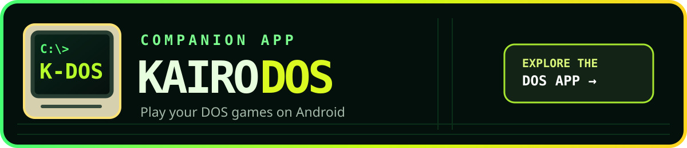
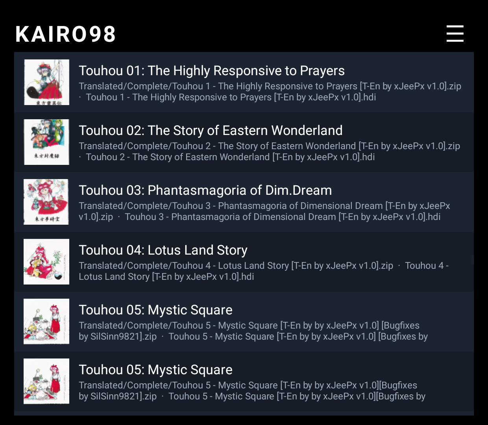
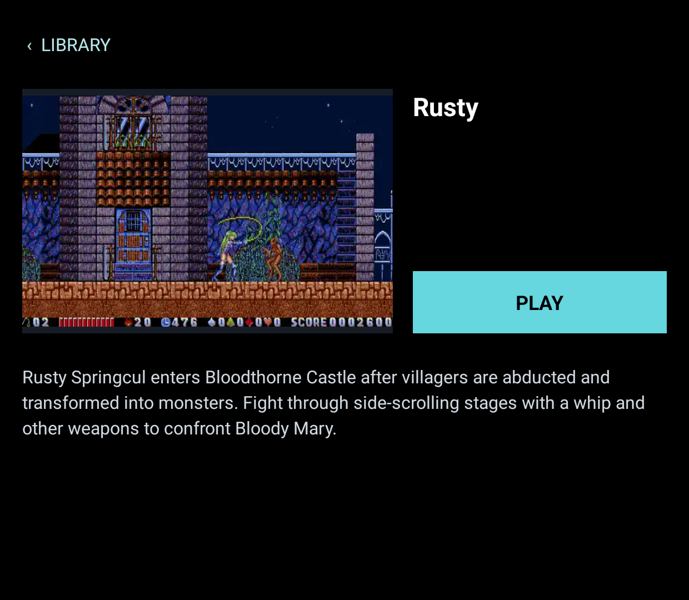
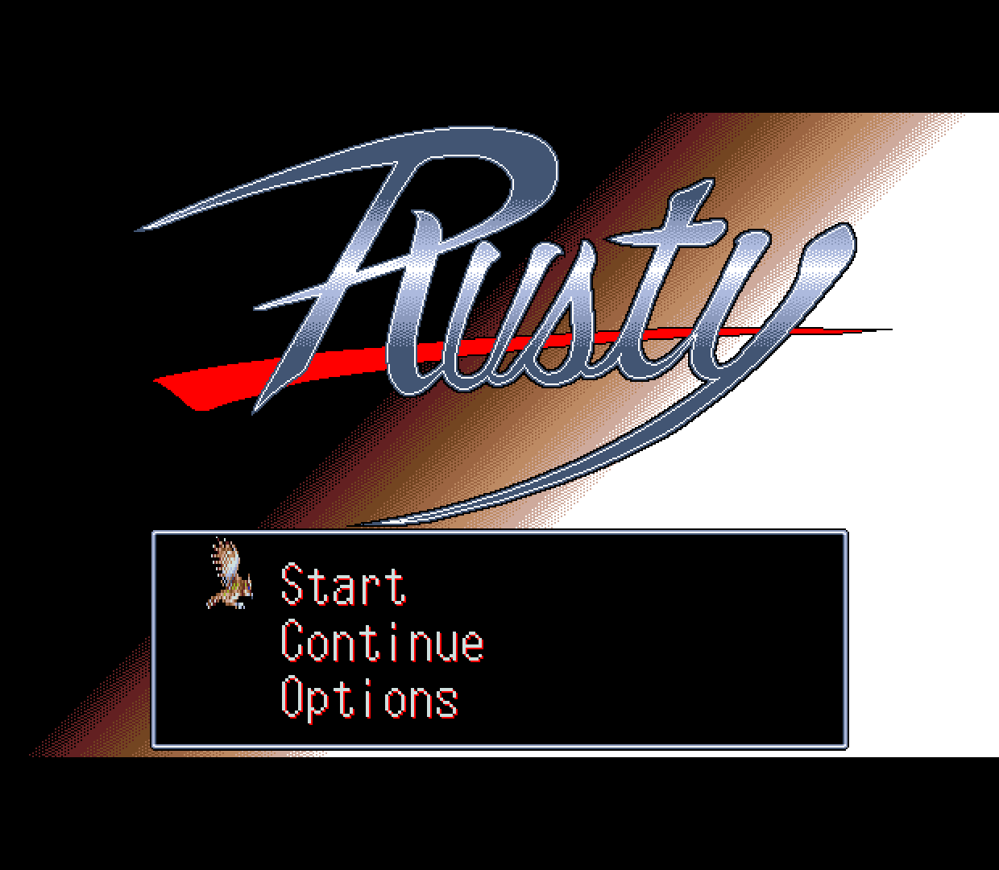
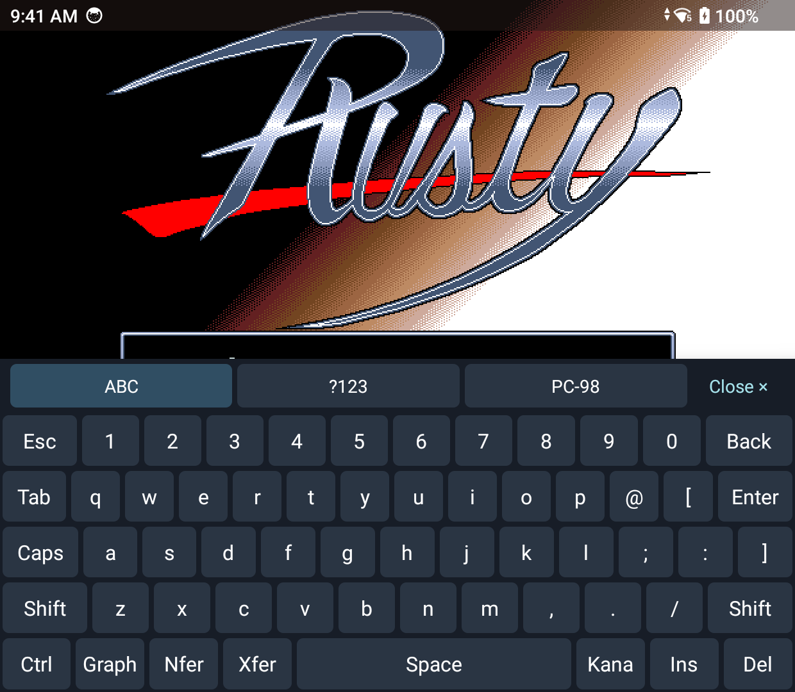

# Kairo98

Kairo98 is an Android PC-98 emulator for phones and handhelds. It combines a game library, controller and touch mapping, an on-screen PC-98 keyboard, and per-game settings with a pinned Neko Project 21/W emulator core and [ymfm](https://github.com/aaronsgiles/ymfm) sound emulation. It is an independent project, not an official release of either core.

[KairoDos](https://github.com/MrJackSpade/KairoDos) is the companion Android DOS emulator. Both apps use the [Kairo shared frontend](https://github.com/MrJackSpade/Kairo) for their library and controls. The [Kairo98 translation project](https://github.com/MrJackSpade/Kairo98-Patches) provides separate English patch work for PC-98 games.

## Screenshots

| Game library | Game details |
| --- | --- |
|  |  |
| Playing a game | On-screen keyboard |
|  |  |

Games shown in screenshots are user-provided and are not bundled with the app.

## Install and add games

1. Install the APK from [GitHub Releases](https://github.com/MrJackSpade/Kairo98/releases) on an ARM64 device running Android 8.0 or newer.
2. Open Kairo98 and select a folder containing your PC-98 disks. You can choose or change the folder from the library menu later.
3. Select a game, review its details, and tap **Play**.

The library accepts HDI hard disks and supported floppy formats including FDI, D88, NFD, HDM, and XDF, as loose files or inside ZIP archives. Catalog matches use disk contents, so recompressing an archive does not change its identity. Some games require a separate boot disk, manual disk swap, or imported firmware. Games, operating systems, and firmware are not supplied.

To remove a source file from device storage, open its **Game settings** and choose **Delete game file**. Kairo98 names the file in a confirmation; deleting a ZIP removes every game inside it. Saves and settings are kept. If an existing ROM folder grant is read-only, select that folder again to grant write access.

The library menu can download missing artwork for games it recognizes. The free GitHub and paid Google Play editions have the same features and behavior.

## External frontends

Use the [external frontend setup guide](docs/frontends.md) to launch Kairo98 games from other apps:

- [LaunchBox for Android](docs/frontends.md#launchbox-for-android)
- [ES-DE](docs/frontends.md#es-de)

## Controls

Map a physical controller to PC-98 keys, joystick and mouse input, or app actions. The same per-game layout also works with on-screen controls. Swipe from the right edge for the PC-98 keyboard. Open the game menu with Android Back, a left-edge swipe, or a controller Menu/Mode button when Android delivers it. The menu offers disk changes, settings, restart, and return to the library. A second Android display can show the keyboard or touchpad during play.

Import your own BIOS, font bitmap, or YM2608 rhythm ROM from **Machine** settings if a game needs them.

## Project information

Report game problems in [Issues](https://github.com/MrJackSpade/Kairo98/issues), including the title, disk format, and what happened. See [catalog behavior](docs/game-catalog.md), [architecture](docs/architecture.md), [source provenance](docs/source-import.md), and [licensing](docs/licensing.md).

First-party code is [GPL-2.0-or-later](LICENSE.md). Clone with `git clone --recurse-submodules` to obtain the pinned shared frontend source.
